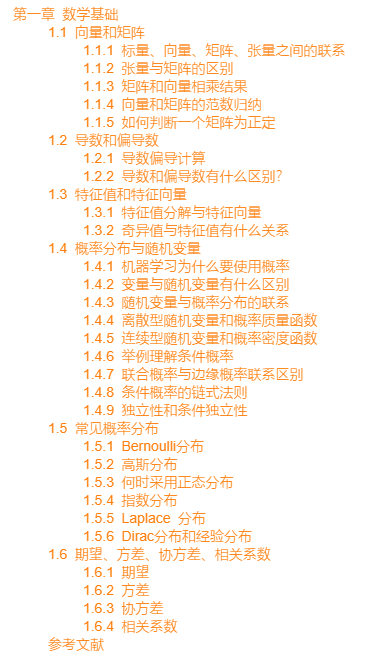
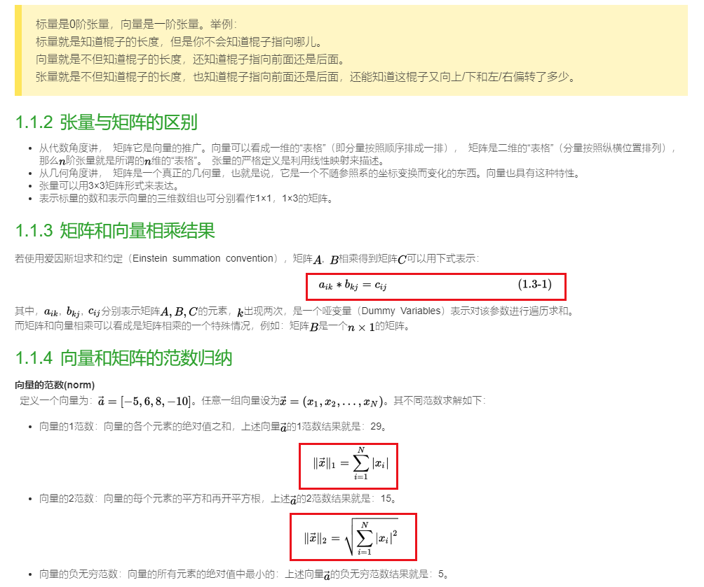

# Awesome-DeepLearning-500FAQ

## 章节分布
```python
01_第一章_数学基础
02_第二章_机器学习基础
03_第三章_深度学习基础
04_第四章_经典网络
05_第五章 卷积神经网络(CNN)
06_第六章_循环神经网络(RNN)
07_第七章 生成对抗网络
08_第八章_目标检测
09_第九章_图像分割
10_第十章_强化学习
11_第十一章_迁移学习
12_第十二章_网络搭建及训练
13_第十三章_优化算法
14_第十四章_超参数调整
15_第十五章_异构运算、GPU及框架选型
16_第十六章_NLP
17_第十七章_模型压缩、加速及移动端部署
18_第十八章_后端架构选型、离线及实时计算
18_第十八章_后端架构选型及应用场景
```

## 格式转换显示
由于之前全部是markdown格式的文件，有些没有安装markdown工具，或者markdown工具不支持LaTex公式的，则会导致公式不能够正常显示。于是我对所有的markdown文件进行了格式转换，转换成：
* HTML格式，下载后直接用浏览器就可以打开查看
* PDF格式，下载后也可以直接查看

注意：在查看内内容的时候，可以直接点击目录中的章节，由于目录是做了锚点的，所以可以直接快速跳转到指定的章节。

## 格式转换之后的效果：
1、HTML的章节显示效果：



2、公式显示效果：




**声明：仅用于个人学习，请勿转载！！！**
